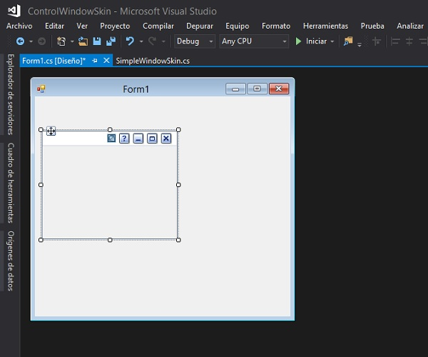
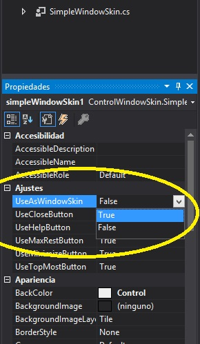

# SimpleWindowSkin
A very simple skin for your forms at C# Windows Forms

# How to get started
* Compile this proyect
* add this control to you Form
* Change some properties like useAsWindowSkin=true
* Try to use the Buttons Events (CloseButton_Click, ...)

(Try to double click on title bar, I was planning to animate that)

***

  
  

  

